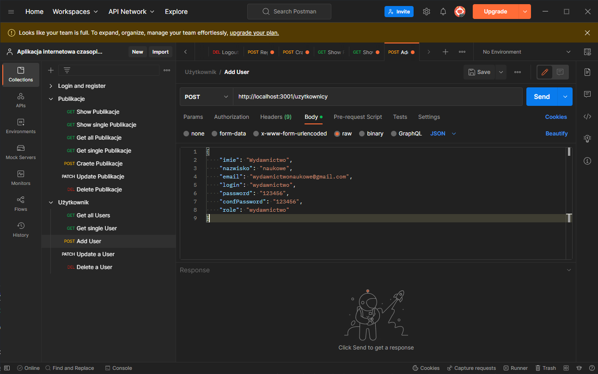

# Backend

## Wymagania:
Wszytko robimy w folderze backend


* Wklejamy do terminala
    ```
    npm install
    ```

* Stworzenie pliku .env oraz wklejenie poniżeszego kodu
    ```
    APP_PORT = 3001
    SESS_SECRET = losowy ciag znaków
    ```

* Stworzenie bazy danych w MySQL o nazwie "czasopisma_naukowe". Polecam do tego pakiet [XAMPP](https://www.apachefriends.org/pl/index.html)

* Odkomentowanie linijki 13, 14 oraz 15 w celu stworzenia tabel, a po uruchomieniu backendu pożniej zakomentować te same linijki, aby modele nie stworzyły się ponownie, bo to usuwa tym samym dane z tabeli.

## Uruchomienie backendu

* Wklejenie do terminala poniższych poleceń
    ```
    npm install -g nodemon
    nodemon index
    ```

## Co zrobić po uruchomieniu backendu
Po uruchomieniu backendu należy użyć narzędzia [Postman](https://www.postman.com/) w celu dodania użytkownika z rolą wydawnictwo. Przykład poniżej
